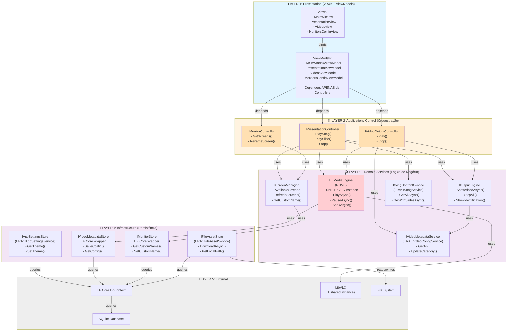
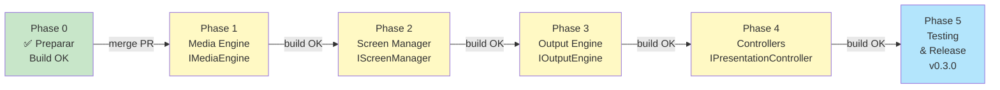

# Arquitetura Desejada (Target) - 7Hinos

## Estrutura de 5 Camadas



---

## Comparação: Antes vs Depois

### ANTES: Tight Coupling
```
PresentationViewModel
├── ISongService ..................... Serviço de dados
├── IAudioService ..................... Serviço infra (com LibVLC)
├── IVideoOutputService .............. Serviço infra (com LibVLC próprio)
├── PlayerViewModel ................... Outro ViewModel
├── PresentationState ................ Classe de estado
└── IMonitorDeviceService ............ Serviço de persistência

PROBLEMAS:
- Conhece 7 dependências
- 2 LibVLC instances conflitando
- Sem orquestração central
- Difícil testar (muitos mocks)
- Difícil adicionar nova feature
```

### DEPOIS: Clean Architecture
```
PresentationViewModel
└── IPresentationController .......... Único contato (orquestrador)
    ├── IMediaEngine ................ Media centralizado (1 LibVLC)
    ├── IOutputEngine ............... Windows + playback
    ├── IScreenManager .............. Detecção de monitores
    └── ISongContentService ........ Dados de hinos

BENEFÍCIOS:
- Conhece 1 dependência
- Sem conflito LibVLC
- Orquestração centralizada
- Fácil testar (mock 1 controller)
- Fácil adicionar PowerPoint player (novo controller)
```

---

## Mudanças por Serviço

| Serviço Atual | Responsabilidades Atuais | Destino Futuro | Mudanças |
|---|---|---|---|
| **AudioService** | Reprodução de áudio com LibVLC | IMediaEngine (consolidado) | Remover instância LibVLC, usar shared |
| **VideoOutputService** | Saída vídeo + windows + múltiplos players | IMediaEngine + IOutputEngine | Usar shared LibVLC |
| **MonitorDeviceService** | Detectar monitors (GetVisualRoot) + names | IScreenManager + Repository | Separar responsabilidades |
| **VideoConfigService** | Persiste metadados vídeo | IVideoMetadataService (rename) | Só persistência, move lógica |
| **AppSettingsService** | Persiste theme | IAppSettingsStore (rename) | Simples rename |
| **FileAssetService** | Download/cache files | IFileAssetStore (rename) | Simples rename |
| **SongService** | Acesso a Songs + Slides | ISongContentService (rename) | Simples rename |
| **Others (8 more)** | Imports, updates | Preservar ou refactor gradual | MVP: não change |

---

## Exemplo: Refatoração da PresentationViewModel

### ANTES (Atual - Acoplada)
```csharp
public sealed partial class PresentationViewModel : ViewModelBase
{
    private readonly ISongService _songService;        // ← Serviço de dados
    private readonly IAudioService _audio;            // ← Infra com LibVLC
    private readonly IVideoOutputService _videoOut;   // ← Infra com outro LibVLC
    private readonly PlayerViewModel _player;         // ← Outro ViewModel
    private readonly PresentationState _state;        // ← Estado
    private readonly IMonitorDeviceService _monitors; // ← Persistência
    
    public async Task PlaySongAsync(int songId)
    {
        var song = await _songService.GetWithSlidesAsync(songId);
        // Lógica espalhada: áudio + vídeo + slides
        _audio.Play(song.AudioFile);
        if (NeedVideo) await _videoOut.ShowVideoAsync(...);
    }
}
```

### DEPOIS (Target - Desacoplada)
```csharp
public sealed partial class PresentationViewModel : ViewModelBase
{
    private readonly IPresentationController _controller;
    
    public PresentationViewModel(IPresentationController controller)
    {
        _controller = controller ?? throw new ArgumentNullException(nameof(controller));
    }
    
    public async Task PlaySongAsync(int songId)
    {
        // Orquestração delegada ao controller
        await _controller.PlaySongAsync(songId, publicScreenIndex, preacherScreenIndex);
    }
}

// Controller (new)
public class PresentationController : IPresentationController
{
    private readonly IMediaEngine _mediaEngine;      // ← Único LibVLC
    private readonly IOutputEngine _outputEngine;    // ← Windows
    private readonly IScreenManager _screens;        // ← Monitores
    private readonly ISongContentService _songs;     // ← Dados
    
    public async Task PlaySongAsync(int songId, int publicScreenIdx, int? preacherScreenIdx)
    {
        var song = await _songs.GetWithSlidesAsync(songId);
        
        // Orquestração centralizada
        await _mediaEngine.PlayAsync(song.AudioFile);
        if (song.HasVideo)
        {
            var screenIndices = GetScreenIndices(publicScreenIdx, preacherScreenIdx);
            await _outputEngine.ShowVideoAsync(song.VideoFile, screenIndices);
        }
    }
}
```

---

## Fases de Migração (com Build Validation)



---

## Checklist: Quando Refatoração Está Completa

- [ ] IMediaEngine implementado com 1 shared LibVLC
- [ ] AudioService usa IMediaEngine (sem privado LibVLC)
- [ ] VideoOutputService usa IMediaEngine (sem privado LibVLC)
- [ ] IScreenManager implementado
- [ ] IOutputEngine implementado
- [ ] IPresentationController implementado
- [ ] PresentationViewModel depende APENAS de IPresentationController
- [ ] VideosViewModel depende APENAS de IVideoOutputController
- [ ] MonitorsConfigViewModel depende APENAS de IMonitorController
- [ ] Testes unitários para cada Controller
- [ ] Build sucede sem warnings
- [ ] Manual testing: áudio funciona
- [ ] Manual testing: vídeo funciona
- [ ] Manual testing: múltiplos monitores funciona
- [ ] Manual testing: áudio + vídeo simultâneo funciona
- [ ] GitHub Actions all green
- [ ] Release v0.3.0

---

**Documento**: Diagramas e Comparações  
**Status**: Proposta  
**Próximo**: Aguardando aprovação do usuário  
